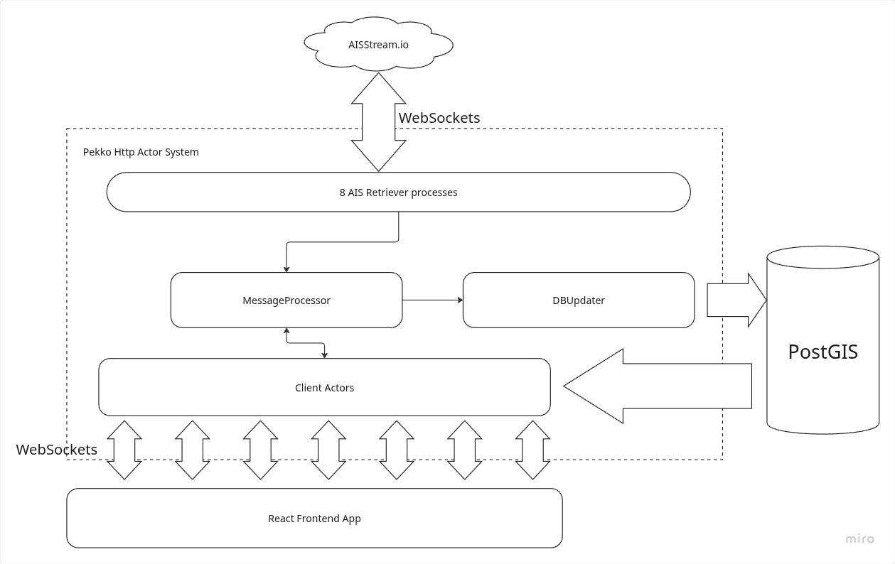

# Orca AIS Viewer

Welcome to the Orca AIS Viewer project!  
This application is designed to process, store, and visualize maritime AIS (Automatic Identification System) data, providing a clear view of vessel traffic.

The entire project is containerized using Docker, ensuring a consistent and easy-to-manage development and deployment environment.

## Prerequisites

Before you begin, ensure you have the following installed on your system:
-   Docker
-   Docker Compose (usually included with Docker Desktop)

## Getting Started

Running the entire application stack is straightforward. The following commands will build the Docker images for the backend and frontend and start all services.

1.  **Configure the environment**:

   - Create a .env file in the `frontend` directory with the following contents: 
    
    REACT_APP_MAPBOX_TOKEN=YOUR_MAPBOX_TOKEN
    REACT_APP_WEBSOCKET_URL=ws://localhost:8088/getAISData
    REACT_APP_ZOOM_LIMIT=12 // This one is optional

   - Make sure the environment variable `AISSTREAM_API_KEY` is set to your AISStream API Key.
   - In case you want to increase the backend logging you can do so by modifying the file `backend/src/main/resources/logback.xml`.
   - There are a couple of configuration options that can be tweaked in the backend although the defaults are working fine:
     - orca-ais-viewer.db-updater.batch: Number of AIS messages to batch before updating them in the DB, currently 100.
     - orca-ais-viewer.aisstream.connections: Number of connections to the aisstream.io service. Options are 1, 3, 4 and 8. 
     Currently using 3 due to getting too many concurrent connections error with a higher connection number.

2.  **Start the application**:

    Run `docker-compose up` in the docker folder, it should trigger the build of the Docker images for backend and frontend, picking up the previously set up variables. 
    In case a variable, setting or code needs to be changed, the application needs to be rebuilt, run the command `docker-compose up --build` to force it.

3.  **Access the application**:
    Once the containers are running, you can access the services at the following addresses:
    -   **Frontend UI**: http://localhost:3000
    -   **Backend API(Metrics)**: http://localhost:8088/metrics
    -   **PostGIS Database**: Connect using a client on `localhost:5432` (User: `postgres`, Password: `postgres`, DB: `ais`)

4.  **Stopping the application**:

    Run `docker-compose down`. PostgreSQL data should be preserved for its next execution. 
    In case there are errors with the network, try running the command with the `--remove-orphans` flag.

## Project Structure

The project is organized into three main directories, following a standard microservice architecture:

-   **`/backend`**: Contains the Scala backend service. It's responsible for handling business logic, processing AIS data, and exposing a REST API.
-   **`/frontend`**: Contains the JavaScript-based frontend application. It consumes the backend API to present a user-friendly interface for visualizing vessel data.
-   **`/docker`**: Contains the core Docker configuration, including the `docker-compose.yml` file to orchestrate all services and the `Dockerfile` for the backend service.

## Technology Stack

This project utilizes a modern and robust technology stack:

-   **Backend**:
    -   **Language**: Scala + Pekko
    -   **Build Tool**: SBT (Scala Build Tool)
    -   **Packaging**: `sbt-assembly` to create a single executable "fat JAR".
-   **Frontend**:
    -   **Language**: Typescript + React
    -   **Build Tool**: npm
-   **Database**:
    -   **Engine**: PostgreSQL
    -   **Extension**: PostGIS for geospatial data support.
-   **Containerization**:
    -   **Engine**: Docker
    -   **Orchestration**: Docker Compose

## Overall Architecture

The backend has been developed using Scala and the Pekko framework, which uses the Actor System. 
When the backend starts the world is divided in a set number of rectangles (In this case, 8) and a number of AISRetriever actors are started, one for each rectangle, to connect to AISStream.io and start consuming AIS data from the service. 
A MessageProcessor actor is created to receive each event and distribute it to:
- DBUpdater actor: This actor is in charge of updating PostgreSQL with the AIS Data event information.
- ClientActors: When a new websocket request comes from the Frontend, a ClientActor is created and registered with MessageProcessor to start receiving AIS Data. The frontend sends a Message with a BoundingBox to only collect data from within that part of the map, the ClientActor queries Postgresql using its PostGIS capabilities to retrieve already existing data within a timeframe (Default 2 minutes) and then starts sending real time data received by MessageProcessor.

The frontend has been developed using Typescript and React(As per the requirement). 
When accessing the Frontend a Websocket connection request is sent to the backend, and a BoundingBox message is sent to request AIS data every time the map is moved or the zoom is changed (If the zoom is greater than a given limit, default 12). 
AIS data for a given vessel will remain on the map for 2 minutes (There is a cycle to remove old data that runs every 30 seconds). 

## Metrics

A number of metrics are available at http://localhost:8088/metrics

Total number of messages upserted into the DB: AisMessagesUpdatedCounter_total 
Total number of messages processed by MessageProcessor: ReceivedMessagesProcessedCounter_total 
Total number of messages retrieved from AISStream.io: ReceivedAISMessageCounter_total 
Total number of messages sent to the Frontend: SentAISMessageCounter_total 
Number of clients connected at a given time: registeredClientActorsGauge 
